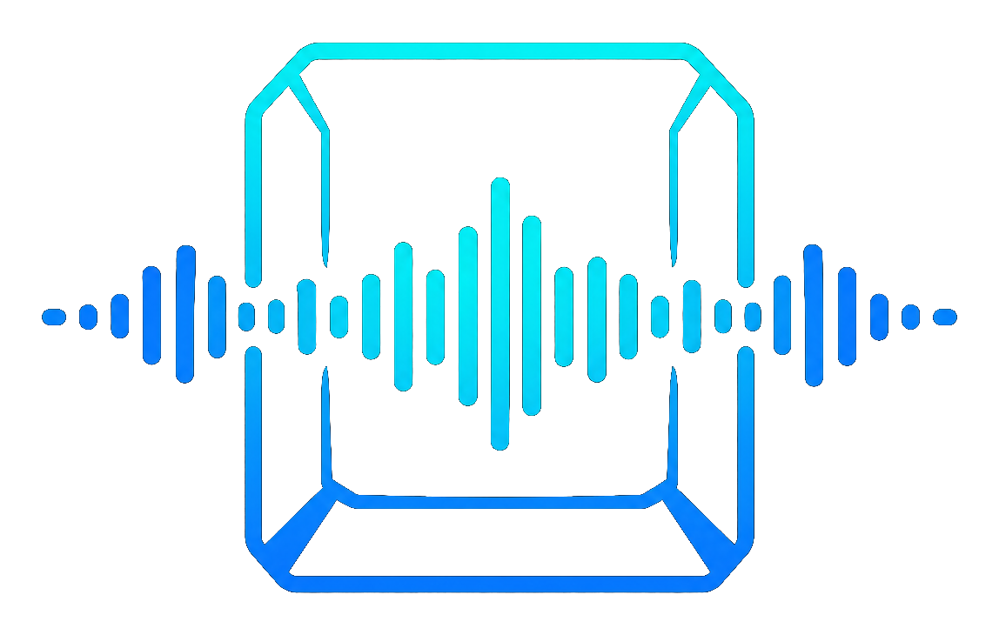

<p align="center">
  
</p>

# WhisperKey

Dictado por voz local, sin nube, bilingüe español/inglés. Apretás una tecla, hablás, y el texto aparece donde estés escribiendo. Usa OpenAI Whisper corriendo en tu GPU — tu voz nunca sale de tu computadora.


---

## 🎯 Para quién es esto

- **Programadores** que dictan código, commits, documentación
- **Escritores** que quieren fluidez sin interrupciones
- **Gamers** que necesitan dictar en chat mientras juegan
- **Profesionales bilingües** que hablan Spanglish técnico
- **Cualquiera** que valore la privacidad y no quiera mandar su voz a la nube

---

## ⚡ Cómo funciona

1. **Apretás F9** (o la tecla que configures) y hablás
2. **Soltás F9** y WhisperKey transcribe tu voz a texto con Whisper
3. **El texto aparece** automáticamente donde estés escribiendo — Notion, VS Code, WhatsApp, el juego que sea

No copiar y pegar. No cambiar de ventana. Apretás, hablás, soltás, y listo.

---

## 🖥️ Dónde lo podés usar

WhisperKey funciona con **cualquier aplicación de escritorio**:

| Tipo | Apps compatibles |
|------|-----------------|
| **Editores de código** | VS Code, IntelliJ, Vim, Neovim |
| **Notas** | Notion, Obsidian, Evernote, OneNote |
| **Mensajería** | WhatsApp Web, Telegram, Slack, Discord |
| **Documentos** | Word, Google Docs, LibreOffice |
| **Juegos** | Cualquier juego con chat (el overlay muestra si está grabando) |
| **Navegadores** | Chrome, Firefox, Edge (formularios, emails, etc.) |
| **Terminales** | PowerShell, Terminal, CMD, WSL |

> ⚠️ Algunas apps que corren como Administrador (elevadas) pueden bloquear la inyección de texto. Si no funciona en una app específica, probá primero en Notepad para confirmar.

---

## 🚀 Instalación (Versión C++ / Whisper.cpp)

Esta rama (`feature/whisper-cpp-migration`) utiliza el motor nativo de C++ **Whisper.cpp**, lo que proporciona importantes ventajas de distribución:
* **Súper ligero**: El instalador y las dependencias de Python ocupan **menos de 100 MB** en disco (eliminando la dependencia de 3 GB de PyTorch).
* **Binarios precompilados**: El instalador descarga los archivos binarios (`main.exe`, `ggml.dll`) y el modelo de forma transparente.
* **Tolerancia a fallos**: Si el binario de GPU CUDA falla o carece de DLLs en tu equipo, la aplicación cambia y descarga automáticamente la versión CPU (AVX2) de respaldo para continuar transcribiendo sin interrupciones.

**Requisitos**: Python 3.12+, Windows 10/11 64-bit (GPU NVIDIA opcional).

```powershell
# 1. Clonar el repo y entrar a la carpeta
git clone https://github.com/p5Patricio/WhisperKey.git
cd WhisperKey
git checkout feature/whisper-cpp-migration

# 2. Correr el instalador gráfico (descarga binarios C++ y modelo automáticamente)
python installer/gui_installer.py

# 3. Ejecutar WhisperKey (sin ventana de terminal)
# Opción A: Doble clic en lanzador.vbs
# Opción B: Desde terminal:
.venv\Scripts\pythonw.exe -m whisperkey
```

El instalador detecta si contás con una GPU NVIDIA y configura los binarios óptimos en `assets/bin/`. En el primer arranque se te guiará con el wizard interactivo de onboarding.

### Requisitos de hardware por modelo (Formatos GGML)

| Modelo | Tamaño del Archivo | RAM Mínima | CPU/GPU Recomendado | Calidad |
|--------|---------------------|------------|---------------------|---------|
| `tiny` | ~75 MB | ~512 MB | CPU (AVX2) o GPU | Básica |
| `base` | ~140 MB | ~1 GB | CPU (AVX2) o GPU | Buena (Recomendado por defecto) |
| `small` | ~460 MB | ~2 GB | CPU fuerte o GPU | Muy buena |
| `medium`| ~1.5 GB | ~4 GB | GPU dedicada | Excelente |
| `large-v3`| ~2.9 GB | ~8 GB | GPU dedicada (VRAM alta) | La mejor |

---

## ⌨️ Cómo usar

### Primer uso

La primera vez que ejecutás WhisperKey aparece un **wizard de bienvenida** que te guía por:

1. **Bienvenida** — presentación rápida
2. **Hardware** — detecta tu GPU y RAM, sugiere modelo óptimo
3. **Micrófono** — test de grabación de 3 segundos para verificar que funciona
4. **Hotkeys** — capturás la tecla que querés usar (por defecto F9)
5. **Inicio automático** — elegís si querés que inicie con Windows
6. **Tutorial** — resumen de cómo usarlo

### Uso diario

| Acción | Tecla | Qué hace |
|--------|-------|----------|
| **Push-to-Talk** | Mantené presionada **F9** | Grabás mientras la mantenés presionada, soltás para transcribir |
| **Toggle** | Apretá **F10** | Empezás a grabar, apretás de nuevo para transcribir |
| **Cargar modelo** | Click derecho en tray → "Cargar modelo" | Carga Whisper en memoria (toma ~10 segundos) |
| **Descargar modelo** | Click derecho en tray → "Descargar modelo" | Libera VRAM para jugar o renderizar |
| **Configuración** | Click derecho en tray → "Configuración" | Abrís la ventana de settings |
| **Salir** | Click derecho en tray → "Salir" | Cierra todo graceful |

### Icono de bandeja (estados)

| Color | Significado |
|-------|-------------|
| 🔘 **Gris** | Sin modelo cargado — hacé clic derecho → "Cargar modelo" |
| 🟡 **Amarillo** | Cargando modelo — esperá unos segundos |
| 🟢 **Verde** | Listo para dictar — apretá F9 y hablá |

### Overlay visual

Cuando grabás, aparece un indicador flotante en la esquina que elegiste (por defecto abajo a la derecha) para que sepas que está escuchando, incluso en juegos a pantalla completa.

---

## ⚙️ Configuración

Hacé clic derecho en el ícono de bandeja → **Configuración**. Se abre una ventana con pestañas:

- **Modelo** — qué modelo Whisper usar, dispositivo (CUDA/CPU), tipo de cómputo
- **Audio** — sample rate, canales, tamaño de cola
- **Hotkeys** — configurá las teclas PTT, Toggle y Cargar modelo (con captura en vivo)
- **Overlay** — activar/desactivar, posición, opacidad, tamaño de fuente
- **Historial** — lista de transcripciones previas con timestamp, copiar al clipboard, limpiar
- **Sistema** — activar/desactivar inicio automático con Windows/Linux/macOS

Los cambios se aplican al reiniciar WhisperKey.

---

## 🔒 Privacidad

- **100% offline** — ningún audio, metadato ni texto sale de tu máquina
- **Sin cuentas** — no necesitás login, API key ni suscripción
- **Sin nube** — Whisper corre localmente en tu GPU
- **Código abierto (MIT)** — podés auditar cada línea

---

## ⚡ Comparativa

| Característica | WhisperKey | Otter.ai | Whisper Desktop | Windows Voice Typing |
|---------------|------------|----------|-----------------|---------------------|
| **100% offline** | ✅ | ❌ | ✅ | ❌ |
| **Spanglish técnico** | ✅ | ⚠️ | ✅ | ❌ |
| **Inyección automática** | ✅ | ❌ | ❌ | ❌ |
| **Overlay visual** | ✅ | ❌ | ❌ | ❌ |
| **Gestión de VRAM** | ✅ | N/A | ❌ | N/A |
| **Historial de dictados** | ✅ | ✅ | ❌ | ❌ |
| **Inicio automático** | ✅ | ❌ | ❌ | ✅ |
| **Código abierto** | ✅ | ❌ | ✅ | ❌ |
| **Sin suscripción** | ✅ | ❌ | ✅ | ✅ |
| **Cross-platform** | ✅ | ✅ | ❌ | ❌ |

---

## 🛠️ Troubleshooting

**El modelo no carga / error de CUDA**
Verificá que tenés drivers NVIDIA actualizados (`nvidia-smi` en terminal). Si el problema persiste, cambiá `device = "cpu"` en Configuración.

**No graba cuando presiono la tecla**
Esperá a que el ícono de bandeja esté 🟢 verde. El modelo tarda ~10 segundos en cargar al arrancar.

**El texto no se pega en la aplicación**
Algunas apps elevadas (admin) bloquean la simulación de teclado. Probá en Notepad primero.

**El overlay no aparece**
Verificá que esté habilitado en Configuración → Overlay. No funciona sobre juegos en fullscreen exclusivo de DirectX.

**WhisperKey no aparece en la bandeja**
Si ejecutaste con `python.exe` en vez de `pythonw.exe`, la terminal se cierra y mata el proceso. Usá `pythonw.exe` o hacé doble clic en `lanzador.vbs`.

---

## 🏗️ Arquitectura (para developers)

```
whisperkey/
├── __main__.py      # composition root — init, threading y graceful shutdown
├── state.py         # AppState thread-safe compartido entre threads
├── config.py        # carga, validación y detección de hardware
├── audio.py         # stream de micrófono (PortAudio via sounddevice)
├── hotkeys.py       # listener de teclado (pynput)
├── transcription.py # modelo Whisper.cpp (main.exe), VAD y worker de transcripción
├── injection.py     # clipboard + Ctrl+V con preservación de contenido
├── overlay.py       # indicador visual (tkinter, siempre encima)
├── tray.py          # ícono en system tray (pystray) con menú condicional
├── history.py       # persistencia de transcripciones en JSONL
├── sounds.py        # feedback auditivo (winsound)
├── errors.py        # jerarquía de excepciones propias
├── splash.py        # splash screen de carga (customtkinter)
├── settings_gui.py  # ventana de configuración con 6 tabs
├── onboarding.py    # wizard de primer uso de 6 pasos
├── platform/        # abstracción cross-platform (Windows/Linux/macOS)
│   ├── base.py
│   ├── windows.py
│   ├── linux.py
│   └── macos.py
└── updater.py       # verificación de actualizaciones desde GitHub
```

**Modelo de threads**

| Thread | Qué hace |
|--------|----------|
| Main | Coordina shutdown, corre system tray y mainloop de tkinter |
| pynput | Escucha teclado, actualiza `AppState` vía getters/setters atómicos |
| PortAudio | Captura audio, encola chunks en `audio_queue` (bounded) |
| transcription_worker | Espera sentinel, transcribe con VAD, inyecta, guarda historial |
| overlay | Corre `tk.mainloop()`, recibe updates vía `root.after()` |
| loader | Carga el modelo al arrancar (daemon) |
| tray | Ejecuta `pystray.Icon.run()` en daemon thread + polling de estado |

---

## 📋 Roadmap

- **Fase 1** ✅ — Reliability & Thread Safety
- **Fase 2** ✅ — Cross-platform (Windows / Linux / macOS)
- **Fase 3** ✅ — GUI Installer + Branding profesional + Historial + Autostart

---

## 🤝 Contribuir

Este proyecto usa [Conventional Commits](https://www.conventionalcommits.org/):

```
feat: descripción de la nueva funcionalidad
fix: descripción del bug corregido
refactor: cambio de código sin nuevo comportamiento
chore: limpieza, dependencias, config
```

`config.toml` está en `.gitignore` — se genera con defaults si no existe.
